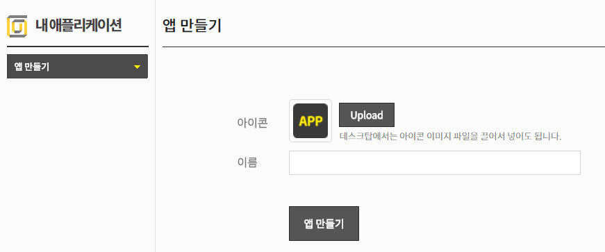
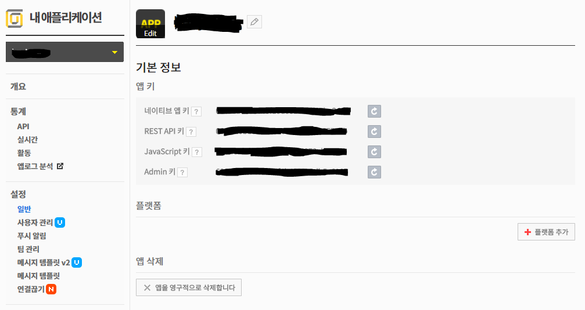
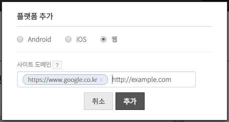

카카오톡에 링크 보내기
==================
1. 카카오 개발자 등록을 한다. (https://developers.kakao.com)
2. 앱등록을 한다. 
 
3. 설정>일반 페이지로 이동 
 
4. 플랫폼추가>웹에 링크하고 싶은 사이트 도메인을 입력 
 
5. 테스트 페이지 만들기

link_test.html

	<!DOCTYPE html>
	<html>
	<head>
	<meta charset="utf-8"/>
	<meta http-equiv="X-UA-Compatible" content="IE=edge"/>
	<meta name="viewport" content="user-scalable=no, initial-scale=1.0, maximum-scale=1.0, minimum-scale=1.0, width=device-width"/>
	<title>API Demo - Kakao JavaScript SDK</title>
	

	</head>
	<body>
	
	</body>
	</html>

	
	
	
자세한 설명은 개발가이드 참고
https://developers.kakao.com/docs/js