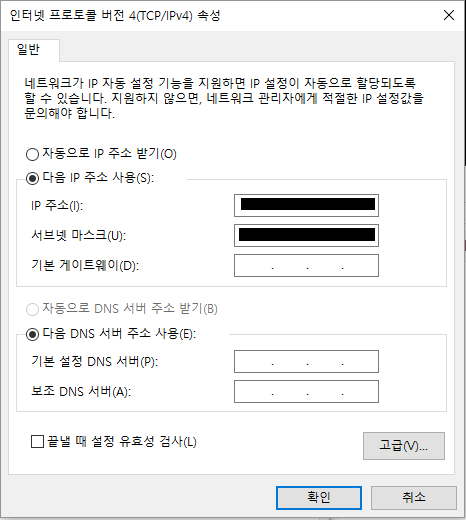

putty 로 접속할 수 있게 하기
==========================
우분투에서 ssh 를 설치해서 외부에서 접속할 수 있게 한다.
--------------------------
```bash
$ sudo apt-get install ssh
```

접속을 위한 22번 포트를 열어준다.</br>
머신 설정->네트워크->[NAT]설정을 한 어댑터 선택->고급->[포트 포워딩]</br>
그림과 같이 22번 포트를 추가한다.</br>
</br>

가상머신 ip 확인
--------------------------
로컬컴퓨터->제어판->네트워크 및 인터넷->네트워크 연결 로 이동</br>
VirtualBox ~ NetWork->속성 선택</br>
</br>
인터넷 프로토콜 버전4(TCP/IPv4)->속성 선택</br>
</br>
IP 주소를 확인한다.

