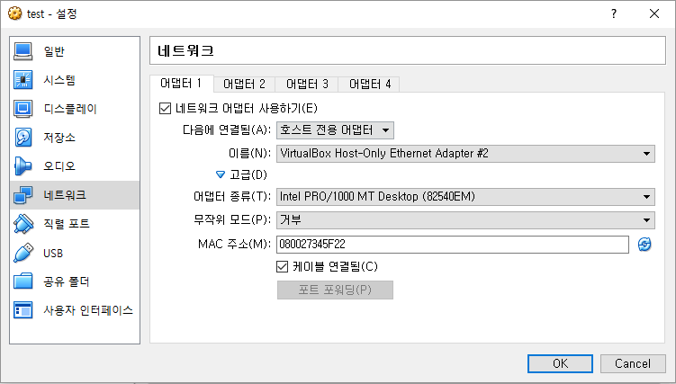
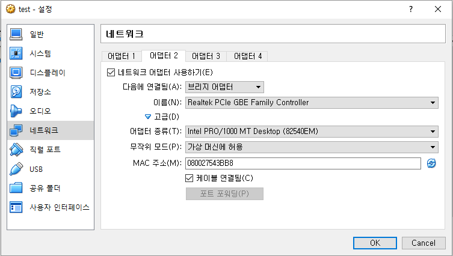
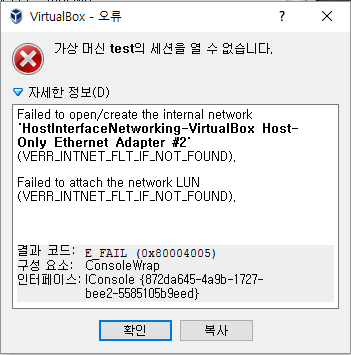
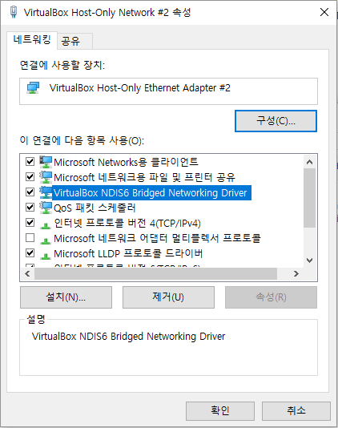

ip 설정
=========================
ip를 설정할 머신을 선택->설정 클릭</br>

네트워크</br>
->어댑터1 [호스트 전용 어댑터] 선택</br>
</br>
->어댑터2 [NAT]나 [브리지 어댑터] 선택</br>
</br>

가상머신에서 ping 테스트를 해서 제대로 연결이 되는지 확인</br>

[터미널] 에서
```bash
$ ping www.google.com
```

다음과 같은 에러가 날 경우
-------------------------
```bash
Failed to open/create the internal network 'HostInterfaceNetworking-VirtualBox Host-Only Ethernet Adapter #2' (VERR_INTNET_FLT_IF_NOT_FOUND).
Failed to attach the network LUN (VERR_INTNET_FLT_IF_NOT_FOUND).
```


로컬 컴퓨터의 네트워크 연결->VirtualBox Host-Only Network->속성
</br>
[VirtualBox ~ Driver] 체크박스에 체크하고 확인
